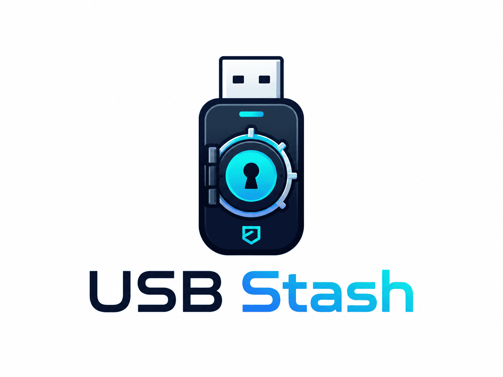

# USB Stash

> **Your portable encrypted vault. Drop it on a USB drive, run it on any PC. Zero install.**

[](CHANGELOG.md)
[](LICENSE)
[](https://rust-lang.org)

USB Stash encrypts your files with **XChaCha20-Poly1305** and stores them in a
single portable container. Carry it on a USB drive. Open it with a double-click.
No installation. No internet connection. No servers. Just you and your password.



---

## Quick install

1. Go to [Releases](https://github.com/jorgealonsodev/usb-stash/releases) and download the files for your OS
2. Copy all downloaded files to your USB drive
3. Run the app:

| OS | Files | Instructions |
|----|-------|-------------|
| **Windows** | `usb-stash-gui-win.exe` + `usb-stash-win.exe` | Double-click `usb-stash-gui-win.exe` for the GUI, or use `usb-stash-win.exe` in terminal |
| **Linux** | `usb-stash-gui-linux` + `usb-stash-linux` + `run.sh` | `bash run.sh` — launches GUI if available, falls back to CLI |

> First run creates a `stash.dat` vault next to the binary.  
> Subsequent runs detect it and prompt for your password.

---

## What it does

| Does | Doesn't |
|------|---------|
| Encrypts files with XChaCha20-Poly1305 (AEAD) | No internet connection |
| Protects passwords with Argon2id (64 MB) | No temp files |
| Detects any file tampering | No installation required |
| Works on Windows 10+ and Linux | No servers or accounts |
| Zeroizes keys and data on close | No password recovery |

---

## Stack

| Layer | Technology | Why |
|------|------------|-----|
| Crypto | `argon2` + `chacha20poly1305` | Modern, audited, no AES-NI required |
| GUI | egui + eframe | Single native binary, no web runtime, immediate-mode rendering |
| CLI | Rust (clap) | Fast, portable, scriptable |
| Build | Cargo workspace | Monorepo, single `cargo build` |

```
┌──────────────────────────────────────────┐
│              USB DRIVE                   │
│  usbstash-win.exe / usbstash-linux       │
│  usbstash-gui-win.exe / usbstash-gui-linux│
│  stash.dat  (encrypted vault)            │
│  stash.meta (public parameters)          │
└──────────────┬───────────────────────────┘
               ▼
┌──────────────────────────────────────────┐
│         egui GUI (usbstash-gui)          │
│  ┌─ Login · Create · Explorer ────────┐  │
│  │  Settings · Auto-lock · Export     │  │
│  └──────────┬──────────────────────────┘  │
│             │ direct calls                │
│  ┌──────────▼──────────────────────────┐  │
│  │  Rust Core (usbstash-core)          │  │
│  │  Argon2id · AEAD · Format · Stash   │  │
│  └─────────────────────────────────────┘  │
└──────────────────────────────────────────┘
```

---

## Usage

### End user

| OS | Instructions |
|----|-------------|
| **Windows** | Double-click `usb-stash-gui-win.exe` (GUI) or use `usb-stash-win.exe` in terminal (CLI) |
| **Linux** | `bash run.sh` (auto-detects GUI/CLI, works on FAT32/exFAT) |

### CLI (developers)

```bash
usbstash create /path/to/stash          # Create new vault
usbstash add /path/to/stash doc.pdf     # Add a file
usbstash list /path/to/stash            # List contents
usbstash extract /path/to/stash doc.pdf # Extract a file
```

---

## Development

### Prerequisites

| Dependency | Version | Install |
|------------|---------|---------|
| Rust | 1.75+ | `rustup install stable` |
| libgtk-3 (Linux) | — | `sudo apt install libgtk-3-dev` |

### Commands

```bash
cargo build --workspace                  # Build all crates
cargo build -p usbstash-gui              # Build GUI only
cargo build -p usbstash-cli              # Build CLI only
```

### Tests & Quality

```bash
cargo test --all                         # All Rust tests
cargo clippy --all -- -D warnings        # Lint
cargo fmt --check                        # Format
```

---

## Performance

| Operation | Time | Hardware |
|-----------|------|----------|
| Key derivation (Argon2id) | ~600ms | Ryzen 5 5600X |
| Open 1 MB stash | ~650ms | 32 GB RAM |
| Open 100 MB stash | ~800ms | NVMe SSD |
| Encrypt 100 MB | ~180ms | — |

*Benchmarked with [Criterion](https://github.com/bheisler/criterion.rs).*

---

## Documentation

| Document | For |
|----------|-----|
| [FILE_FORMAT.md](FILE_FORMAT.md) | Developers implementing an independent decoder |
| [THREAT_MODEL.md](THREAT_MODEL.md) | Security auditors, pentesters |
| [SECURITY.md](SECURITY.md) | Finding a vulnerability |
| [CONTRIBUTING.md](CONTRIBUTING.md) | Contributing code |
| [CHANGELOG.md](CHANGELOG.md) | Version history |

---

## Design decisions

| Decision | Why |
|----------|-----|
| XChaCha20 over AES-GCM | 24-byte nonces (no collision risk), no AES-NI required |
| Argon2id with 64 MB | OWASP 2024: balance of security and interactive usability |
| Single container (`stash.dat`) | Individual filenames never exposed |
| Zero network connections | Defense in depth: the app cannot leak data |
| egui over Tauri/Svelte | Single binary, no web runtime, no Node.js dependency |
| Bincode over JSON | Binary, compact, deterministic |

---

## License

Apache 2.0 — [LICENSE](LICENSE)
